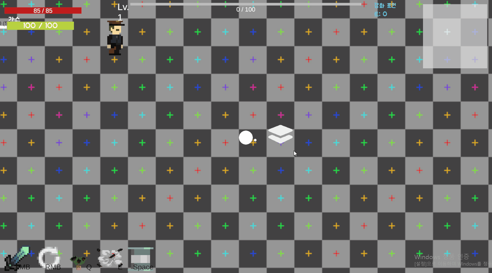
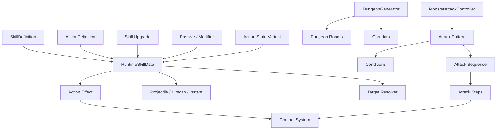

# Project-Expedition Showcase

Unity로 개발 중인 **Project Expedition**에서 구현한 주요 게임 시스템을 선별하여 정리한 포트폴리오 Showcase입니다.

본 저장소는 전체 Unity 프로젝트를 배포하지 않고, 프로젝트에서 직접 설계·구현한 시스템 중 구조적 특징과 확장성을 확인할 수 있는 일부 소스 코드와 기능 시연 자료를 공개합니다.

## Overview

| 항목 | 내용 |
| --- | --- |
| Engine | Unity 6000.3.12f1 |
| Language | C# |
| Main Showcase | Action / Skill Framework, Procedural Dungeon Generation, Monster Attack Pattern System |
| Technical Highlights | Save Data Integrity & Recovery, Photon Fusion Multiplayer |
| Architecture | ScriptableObject 기반 Data-Driven System / Runtime Data 분리 / 조합형 기능 설계 |

Project Expedition에서는 캐릭터나 스킬마다 개별 로직을 반복해서 구현하기보다, **공통 실행 구조를 먼저 정의하고 데이터와 조합을 통해 서로 다른 게임 동작을 표현하는 방식**을 중심으로 시스템을 설계했습니다.

주요 구조는 다음과 같습니다.

```text
Character / Skill
       │
       ▼
 Action Framework
       │
       ├─ Target
       ├─ Delivery
       ├─ Effect
       ├─ Status
       └─ Runtime Modifier
       │
       ▼
     Combat
       │
       ▼
Monster / Dungeon
```

---

# Main Showcase

## 1. Data-Driven Action & Skill Framework


서로 다른 스킬을 각각 별도의 전용 로직으로 구현하지 않고, `SkillDefinition`과 `ActionDefinition`을 조합하여 다양한 행동을 구성할 수 있도록 만든 공통 Action / Skill Framework입니다.

### Action 구성

하나의 `ActionDefinition`에서 다음 요소를 데이터로 정의할 수 있습니다.

```text
Action
├─ Delivery
│  ├─ Instant
│  ├─ Projectile
│  └─ Hitscan
│
├─ Target
│  ├─ Target Mode
│  ├─ Target Filter
│  └─ Layer
│
├─ Area
│  ├─ Radius
│  └─ Sector
│
├─ Projectile
│  ├─ Speed
│  ├─ Lifetime
│  ├─ Count
│  ├─ Spread
│  └─ Growth
│
├─ State Variant
│
└─ Effects
```

이를 통해 단일 투사체, 다중 투사체, 범위 공격, 지속 효과 등 서로 다른 동작을 같은 실행 구조 안에서 처리합니다.

### Skill → Action 구조

`SkillDefinition`은 스킬의 ID, 자원 소모, 활성 방식, Cooldown 등의 상위 정보를 가지고 있으며 실제 행동은 `ActionDefinition`과 연결됩니다.

```text
SkillDefinition
      │
      ├─ Identity
      ├─ Resource Cost
      ├─ Cooldown
      ├─ Activation
      └─ Skill Tags
      │
      ▼
ActionDefinition
      │
      ├─ Delivery
      ├─ Target
      ├─ Area
      └─ Effects
```

즉 **Skill이 “언제, 어떤 비용으로 사용되는가”를 정의하고 Action이 “실제로 무엇을 하는가”를 담당**하도록 역할을 분리했습니다.

---

## Runtime Skill Data

원본 ScriptableObject의 값을 Runtime에서 직접 수정하지 않고, 실행 시 독립적인 `RuntimeSkillData`를 생성하여 사용합니다.

```text
SkillDefinition
       +
ActionDefinition
       │
       ▼
RuntimeSkillData
       │
       ├─ Skill Upgrade
       ├─ Equipment Modifier
       ├─ Passive Modifier
       └─ State Variant
       │
       ▼
Final Runtime Action
```

이를 통해 원본 데이터는 유지하면서 캐릭터 상태나 장비, 강화 효과에 따라 실제 실행 값만 변경할 수 있도록 했습니다.

`RuntimeActionEffectData` 역시 원본 `ActionEffectInfo`를 복사하여 별도의 Runtime 상태를 가집니다.

따라서 같은 Skill Asset을 사용하더라도 개별 실행마다 서로 다른 상태와 Modifier를 적용할 수 있습니다.

---

## Effect System

Action의 실제 결과는 `ActionEffectInfo`와 `ActionEffectExecutor`를 통해 처리합니다.

Effect는 크게 다음과 같은 형태를 공통 구조에서 처리할 수 있도록 구성했습니다.

```text
Action Effect
├─ Value
│  ├─ Damage
│  └─ Heal
│
├─ Movement
│  ├─ Dash
│  ├─ Push
│  └─ Pull
│
├─ Status
│
├─ Defense
│
└─ Special Effect
```

Effect 데이터와 실제 적용 로직을 분리하여 Action 종류가 늘어나더라도 Target 탐색이나 Projectile 동작을 다시 구현하지 않고 기존 실행 구조를 재사용할 수 있도록 했습니다.

---

## Status & Trigger

Action Framework 내부에는 일회성 Effect뿐 아니라 지속적인 상태와 반응형 효과도 포함되어 있습니다.

```text
Action
  │
  ├─ Status
  │    ├─ Duration
  │    ├─ Tick
  │    ├─ Stack
  │    └─ Reapply
  │
  └─ Trigger
       └─ Event 발생
             ↓
        Reaction Action
```

`ActionStatusController`는 적용된 Status의 지속 시간, Tick, Stack과 재적용을 관리합니다.

`ActionTriggerController`는 Damage 등의 게임 Event에 반응하여 등록된 Reaction Action을 실행할 수 있도록 구성했습니다.

---

## Skill Upgrade

Skill 강화 역시 원본 Skill을 별도로 복제하는 방식이 아니라 Modifier 데이터를 Runtime 값에 적용합니다.

```text
Base Runtime Value
        │
        ▼
AddFlat
        │
        ▼
AddPercent
        │
        ▼
Multiply
        │
        ▼
Final Runtime Value
```

`SkillUpgradeDefinition`은 Modifier를 연산 순서에 따라 적용하여 최종 Runtime 데이터를 생성합니다.

이를 통해 강화 단계마다 별도의 Skill Script를 만드는 대신 **기존 Skill의 특정 수치를 데이터 기반으로 변경**할 수 있도록 했습니다.

---

# 2. Procedural Dungeon Generation



Grid 기반으로 Room을 배치하고 연결 관계를 생성하여 Dungeon Layout을 구성하는 Procedural Dungeon Generator입니다.

### Generation Pipeline

```text
Seed 설정
   ↓
Start Cell 생성
   ↓
Normal Room 확장
   ↓
Occupied Cell 검사
   ↓
Boss Room 선정
   ↓
Chest Room 선정
   ↓
Room Connection 생성
   ↓
Room Prefab 생성
   ↓
Door 연결
   ↓
Corridor 생성
```

`DungeonGenerator`는 Dungeon의 논리적인 Grid Layout과 Room 관계를 먼저 생성한 뒤 실제 Room과 Corridor를 배치합니다.

### Grid-based Layout

생성된 Room의 위치는 `Vector2Int` Cell 단위로 관리하며 이미 사용 중인 Cell은 `HashSet`으로 추적합니다.

```text
□ □ ■ □
□ ■ ■ ■
□ □ S □
□ □ ■ B
```

- `S` : Start Room
- `■` : Normal Room
- `B` : Boss Room

새로운 Room은 기존 Room에서 인접 Cell로 확장하며 중복 배치를 방지합니다.

### Seed

고정 Seed와 Random Seed 방식을 모두 지원하도록 구성했습니다.

같은 Seed를 사용할 때 생성 결과의 재현성을 높이기 위해 생성 과정에서 순서가 불명확한 Collection 순회에 의존하지 않고, 일정한 후보 순서를 사용하는 부분도 고려했습니다.

### Room Connection

Room의 배치와 연결 관계를 분리해 관리합니다.

```text
Room A
   │
DungeonConnection
   │
Room B
```

생성된 `DungeonConnection` 데이터를 바탕으로:

- Room Door 활성화
- 인접 Room 연결
- Corridor 생성

을 처리합니다.

따라서 Room 배치 알고리즘과 실제 Scene Object 생성 로직을 분리할 수 있도록 구성했습니다.

---

# 3. Monster Attack Pattern System


몬스터의 공격을 하나의 긴 AI 함수에 직접 작성하지 않고, **Condition → Pattern → Sequence → Step** 구조로 나누어 조합할 수 있도록 만든 공격 시스템입니다.

## Attack Selection

```text
MonsterAttackController
        │
        ▼
Available Patterns 검사
        │
        ├─ Condition
        ├─ Priority
        └─ Cooldown
        │
        ▼
Selected Pattern
        │
        ▼
MonsterAttackSequence
```

`MonsterAttackController`는 현재 상황에서 실행 가능한 Pattern을 검사하고 조건과 우선순위를 기준으로 공격을 선택합니다.

### Condition

현재 Showcase에는 다음 Condition 구현 예제가 포함되어 있습니다.

```text
DistanceAttackCondition
└─ Target과의 거리 검사

HpRateAttackCondition
└─ Monster의 현재 HP 비율 검사
```

Condition을 별도 타입으로 분리했기 때문에 새로운 공격 선택 조건이 필요한 경우 Controller 자체를 수정하는 대신 새로운 Condition을 추가할 수 있습니다.

---

## Sequence & Step

실제 하나의 공격은 여러 `MonsterAttackStep`을 순서대로 조합하여 구성합니다.

```text
MonsterAttackSequence

Wait
 ↓
Projectile
 ↓
Wait
 ↓
Charge
 ↓
Circle
```

모든 Step은 공통 기반인:

```csharp
public abstract IEnumerator Execute(MonsterAttackContext context);
```

형태로 실행됩니다.

현재 Showcase에는 다음 Step 구현을 포함하고 있습니다.

- `ProjectileAttackStep`
- `ChargeAttackStep`
- `CircleAttackStep`
- `SectorAttackStep`
- `WaitAttackStep`

이를 통해 공격마다 새로운 Controller를 만드는 대신 **필요한 Step을 조합하여 새로운 공격 Sequence를 구성**할 수 있습니다.

---

## Attack Context

Sequence의 각 Step은 `MonsterAttackContext`를 통해 동일한 Runtime 정보를 공유합니다.

```text
MonsterAttackContext
├─ Monster
├─ Target
├─ Damage
├─ Damage Type
├─ Indicator
├─ Projectile Spawn Point
└─ Runtime State
```

각 Step이 Monster의 내부 구현에 직접 강하게 의존하지 않고 필요한 Context를 전달받아 실행하도록 구성했습니다.

---

# System Architecture



Project Expedition에서는 각각의 기능을 독립적인 특수 구현으로 만드는 대신, **공통 데이터를 통해 실행 구조를 연결하고 세부 동작을 교체·확장할 수 있도록 구성하는 방향**을 사용했습니다.

---

# Technical Highlights

## 4. Save Data Integrity & Recovery

게임 저장 데이터를 단순히 하나의 JSON 파일에 덮어쓰는 방식이 아니라 Main / Backup / Temporary 파일을 이용해 저장 실패나 파일 손상에 대응하도록 구성했습니다.

```text
slot_0.json   → Main
slot_0.bak    → Backup
slot_0.tmp    → Temporary
```

### Load Flow

```text
Main 검사
   │
   ├─ Valid
   │    └─ Load
   │
   └─ Invalid
        ↓
    Backup 검사
        ↓
   Temporary 검사
        ↓
  유효 데이터 발견
        ↓
    Main 복구
```

`SaveDataManager`는 다음 기능을 담당합니다.

- 3개의 Save Slot 관리
- Save 생성 / 로드 / 저장 / 삭제
- Save Version 검증
- Main / Backup / Temporary 파일 검증
- 유효한 Backup 데이터에서 Main 복구
- 플레이 시간 기록
- Dirty Flag를 이용한 변경 상태 관리
- Runtime Player 데이터와 Save Data 연결

저장 기능 자체보다 **데이터 손상이나 비정상 종료 시 복구 가능성을 고려한 구조**에 중점을 두었습니다.

---

## 5. Multiplayer — Host Authority & State Synchronization

Photon Fusion을 이용하여 Host / Client Session과 Player State 동기화 구조를 구현했습니다.

> Photon Fusion SDK 자체는 본 Showcase 저장소에 포함하지 않습니다.

### Session

`NetworkSessionManager`가 `NetworkRunner`의 생성과 수명주기를 관리합니다.

```text
NetworkSessionManager
      │
      ├─ Start Host
      ├─ Start Client
      ├─ Session Setup
      └─ Shutdown
```

Host와 Client 모두 동일한 Session 진입 흐름을 사용하며, Session 시작 실패 또는 종료 시 NetworkRunner 상태를 정리하도록 구성했습니다.

### Authority

Player의 지속적인 Gameplay State는 Host의 State Authority에서 결정합니다.

```text
Local Input
     ↓
Input Authority
     ↓
Host / State Authority
     ↓
Authoritative State
     ↓
[Networked] Snapshot
     ↓
Client Proxy
```

`NetworkPlayerStateController`에서는 다음 정보를 하나의 Network State로 관리합니다.

- Character Type
- Character Name
- Current / Maximum HP
- Injury Stack
- Character Primary Resource
- Profile Ready State
- Death State

Client가 선택한 Character Profile은 RPC를 통해 Host에 전달하고, Host에서 지원되는 Character인지 검증한 뒤 최종 상태로 확정합니다.

### State Revision

모든 Render 단계에서 Player 상태를 다시 적용하지 않고 `StateRevision`을 이용해 새로운 상태를 수신한 경우에만 Proxy Runtime을 갱신합니다.

```text
Network State
     ↓
Revision 동일
     └─ Skip

Revision 변경
     ↓
Apply Proxy State
```

---

# Selected Source Code

## Action / Skill

| 파일 | 역할 |
| --- | --- |
| [`ActionDefinition.cs`](Source/ActionSkill/Core/ActionDefinition.cs) | Action의 Delivery, Target, Area, Projectile, Effect 등을 정의 |
| [`SkillDefinition.cs`](Source/ActionSkill/Core/SkillDefinition.cs) | Skill의 Identity, Cost, Cooldown 및 Action 연결 |
| [`RuntimeSkillData.cs`](Source/ActionSkill/Core/RuntimeSkillData.cs) | Definition을 기반으로 Modifier가 적용되는 독립 Runtime 데이터 관리 |
| [`ActionTargetResolver.cs`](Source/ActionSkill/Core/ActionTargetResolver.cs) | Target Mode, Filter, Area에 따른 대상 탐색 |
| [`ActionProjectile.cs`](Source/ActionSkill/Core/ActionProjectile.cs) | Projectile 이동, 수명, 충돌, 관통 및 Effect 처리 |
| [`ActionEffectExecutor.cs`](Source/ActionSkill/Effects/ActionEffectExecutor.cs) | Effect Type에 따른 실제 게임 효과 실행 |
| [`ActionStatusController.cs`](Source/ActionSkill/Status/ActionStatusController.cs) | Status Duration, Tick, Stack 및 재적용 관리 |
| [`SkillUpgradeDefinition.cs`](Source/ActionSkill/Upgrade/SkillUpgradeDefinition.cs) | Skill Upgrade Modifier 적용 |

## Dungeon

| 파일 | 역할 |
| --- | --- |
| [`DungeonGenerator.cs`](Source/Dungeon/DungeonGenerator.cs) | Dungeon Grid Layout과 특수 Room 배치 생성 |
| [`DungeonConnection.cs`](Source/Dungeon/DungeonConnection.cs) | Room 사이의 연결 관계 표현 |
| [`DungeonCorridorGenerator.cs`](Source/Dungeon/DungeonCorridorGenerator.cs) | Connection 데이터를 기반으로 Corridor 생성 |
| [`DungeonRoom.cs`](Source/Dungeon/DungeonRoom.cs) | 개별 Room의 Connection 및 Runtime 상태 관리 |
| [`DungeonRoomConnectionController.cs`](Source/Dungeon/DungeonRoomConnectionController.cs) | Room 연결 방향에 따른 Door 상태 적용 |

## Monster Attack

| 파일 | 역할 |
| --- | --- |
| [`MonsterAttackController.cs`](Source/MonsterAttack/Core/MonsterAttackController.cs) | Condition, Priority, Cooldown 기반 Pattern 선택 및 실행 |
| [`MonsterAttackPattern.cs`](Source/MonsterAttack/Core/MonsterAttackPattern.cs) | Sequence와 실행 Condition 구성 |
| [`MonsterAttackSequence.cs`](Source/MonsterAttack/Core/MonsterAttackSequence.cs) | 하나의 공격을 구성하는 Step 목록 정의 |
| [`MonsterAttackStep.cs`](Source/MonsterAttack/Core/MonsterAttackStep.cs) | 모든 공격 Step의 공통 기반 |
| [`ProjectileAttackStep.cs`](Source/MonsterAttack/Steps/ProjectileAttackStep.cs) | Projectile 공격 구현 예제 |
| [`ChargeAttackStep.cs`](Source/MonsterAttack/Steps/ChargeAttackStep.cs) | Charge 공격 구현 예제 |

## Technical Highlights

| 파일 | 역할 |
| --- | --- |
| [`SaveDataManager.cs`](Source/TechnicalHighlights/SaveSystem/SaveDataManager.cs) | Save Slot, 저장/로드, Backup 및 Recovery 관리 |
| [`NetworkSessionManager.cs`](Source/TechnicalHighlights/Multiplayer/NetworkSessionManager.cs) | Photon Fusion Session 및 NetworkRunner 수명주기 관리 |
| [`NetworkPlayerStateController.cs`](Source/TechnicalHighlights/Multiplayer/NetworkPlayerStateController.cs) | Host authoritative Player State 복제 |
| [`PlayerNetworkState.cs`](Source/TechnicalHighlights/Multiplayer/PlayerNetworkState.cs) | 동기화되는 Player State Snapshot |

---

# Repository Structure

```text
Project-Expedition-Showcase/
├─ Media/
│  ├─ action-skill-framework.gif
│  ├─ dungeon-generation.gif
│  └─ monster-attack-system.gif
│
├─ Source/
│  ├─ ActionSkill/
│  │  ├─ Core/
│  │  ├─ Effects/
│  │  ├─ Status/
│  │  └─ Upgrade/
│  │
│  ├─ Dungeon/
│  │
│  ├─ MonsterAttack/
│  │  ├─ Core/
│  │  ├─ Conditions/
│  │  └─ Steps/
│  │
│  └─ TechnicalHighlights/
│     ├─ SaveSystem/
│     └─ Multiplayer/
│
├─ NOTICE.md
└─ README.md
```

---

# Repository Scope

본 저장소는 **Project Expedition의 전체 Unity 프로젝트가 아닙니다.**

포트폴리오 검토를 목적으로 직접 구현한 시스템 중 구조와 확장성을 확인할 수 있는 일부 소스 코드와 시연 자료만 선별하여 공개하고 있습니다.

원본 프로젝트에서 사용하는 외부 에셋, 플러그인, 오디오, 이미지 및 기타 라이선스 리소스는 포함하지 않습니다.

특히 Multiplayer 구현에서 사용하는 **Photon Fusion SDK 및 관련 외부 소스 코드는 본 저장소에 포함하지 않습니다.**

공개된 일부 클래스는 원본 프로젝트의 Character, Combat, UI, Passive, Equipment 등의 시스템에 의존하므로 본 저장소만으로 Unity 프로젝트를 실행하거나 빌드할 수 없습니다.

자세한 공개 범위와 외부 리소스 관련 내용은 [`NOTICE.md`](NOTICE.md)를 참고해주세요.
