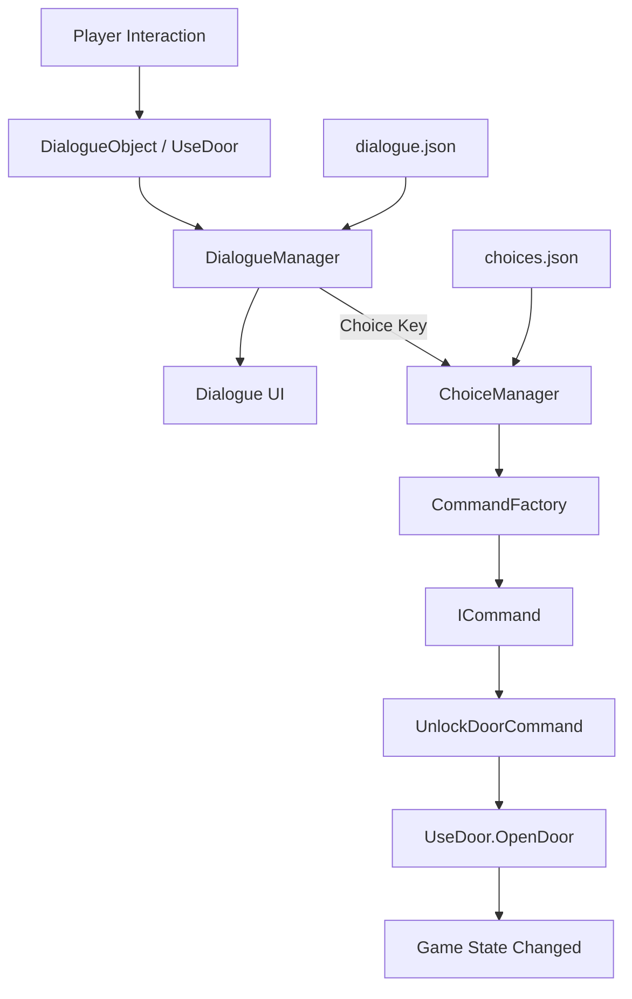

# AdventureGame Showcase

Unity로 제작한 AdventureGame 프로젝트에서 구현한 **데이터 기반 대화 및 선택지 시스템**을 정리한 포트폴리오 Showcase입니다.

본 저장소에서는 전체 Unity 프로젝트를 배포하지 않고, 대화 데이터를 게임 로직과 분리하여 관리하고 선택 결과를 실제 게임 상호작용으로 연결하는 구조를 확인할 수 있는 일부 소스 코드와 Sample Data, 기능 시연 자료를 공개합니다.

## Overview

| 항목 | 내용 |
| --- | --- |
| Engine | Unity 2022.3.62f3 |
| Language | C# |
| Data Format | JSON |
| UI | TextMeshPro / Unity UI |
| Showcase | Dialogue / Choice / Command-based Interaction |

AdventureGame에서는 NPC와 오브젝트마다 대화 내용을 코드에 직접 작성하는 대신, **대화와 선택지 데이터를 JSON으로 분리하여 관리**하도록 구성했습니다.

대화가 종료된 뒤 선택지가 필요한 경우 `ChoiceManager`로 전달하고, 선택 결과는 `CommandFactory`를 통해 실제 게임 동작으로 변환됩니다.

```text
Dialogue JSON
      ↓
DialogueManager
      ↓
ChoiceManager
      ↓
CommandFactory
      ↓
ICommand
      ↓
Game Interaction
```

이를 통해 **대화 데이터와 실제 게임 로직을 분리하면서도 선택 결과가 게임 상태에 영향을 줄 수 있도록 구성**했습니다.

---

# Key Features

## 1. JSON-based Dialogue System


대화 내용을 외부 JSON 데이터로 관리하고 Runtime에서 필요한 대화 데이터를 불러와 출력하는 시스템입니다.

### 주요 기능

- `StreamingAssets`의 JSON 파일에서 대화 데이터 로드
- Category와 Sequence를 조합한 Key를 이용한 대화 탐색
- 화자 이름과 대사 출력
- 여러 줄의 연속 대화 지원
- Coroutine 기반 Typewriter 효과
- 입력을 통한 현재 문장 즉시 출력 및 다음 대화 진행
- 캐릭터 일러스트 표시 및 상태 변경
- 대화 중 게임 시간 정지
- 대화 종료 후 선택지 시스템으로 연결

대화 데이터는 다음과 같이 게임 로직과 분리되어 있습니다.

```json
{
  "dialogues": {
    "1-1": [
      {
        "id": 1,
        "speaker": "NPC",
        "lines": [
          "안녕하세요!",
          "어서 오세요!"
        ]
      }
    ]
  }
}
```

`DialogueObject` 또는 상호작용 가능한 게임 오브젝트에서는 실제 문장을 직접 가지고 있지 않고, 필요한 Dialogue Key를 통해 `DialogueManager`에 대화를 요청합니다.

```text
Interaction
     ↓
Dialogue Category + Sequence
     ↓
DialogueManager
     ↓
JSON Data Search
     ↓
Dialogue UI
```

이를 통해 대사의 수정이나 추가가 게임 로직 수정으로 직접 이어지지 않도록 구성했습니다.

---

## 2. Dialogue Progression

하나의 오브젝트와 반복해서 상호작용했을 때 항상 같은 대화만 출력하지 않고, 설정된 진행 조건에 따라 다음 Dialogue Sequence로 변경할 수 있도록 구현했습니다.

```text
First Interaction
      ↓
Dialogue 1-1

Repeated Interaction
      ↓
Change Point 도달
      ↓
Dialogue 1-2
```

`DialogueObject`는 상호작용 횟수를 기록하고 설정된 `changePoint`에 도달하면 다음 Sequence를 사용합니다.

이를 이용해 NPC나 환경 오브젝트가 게임 진행 상황에 따라 서로 다른 대화를 제공할 수 있도록 했습니다.

---

## 3. Choice System


대화 종료 시 JSON 데이터에 선택지 Key가 존재하면 `ChoiceManager`가 해당 선택지 목록을 생성합니다.

### Choice Data

```json
{
  "choices": {
    "1-1": [
      {
        "text": "문을 강제로 연다.",
        "result": "UnlockDoor"
      },
      {
        "text": "다른 방법을 찾는다.",
        "result": "FindAnotherPath"
      }
    ]
  }
}
```

선택지 버튼 역시 미리 고정해 두는 방식이 아니라 JSON 데이터의 개수에 따라 Runtime에서 동적으로 생성합니다.

```text
Dialogue 종료
     ↓
Choice Key 확인
     ↓
Choice JSON 검색
     ↓
Button 동적 생성
     ↓
Player Selection
```

따라서 선택지의 문구와 개수를 데이터에서 관리할 수 있습니다.

---

## 4. Command-based Interaction

선택 결과를 `ChoiceManager` 내부에서 직접 처리하지 않고 `ICommand` 인터페이스와 `CommandFactory`를 통해 실제 행동으로 변환합니다.

```text
Choice Result
     ↓
"UnlockDoor"
     ↓
CommandFactory
     ↓
UnlockDoorCommand
     ↓
UseDoor.OpenDoor()
```

현재 Showcase에는 다음 Command 예제가 포함되어 있습니다.

```text
UnlockDoorCommand
└─ 선택 대상의 UseDoor를 찾아 Door 상태 변경

FindAnotherPathCommand
└─ 다른 선택 결과를 처리하기 위한 Command 예제
```

`ChoiceManager`는 어떤 게임 동작이 실행되는지 직접 알 필요 없이 JSON의 `result` 값에 대응하는 Command만 생성합니다.

이 구조를 통해 새로운 선택 결과가 필요한 경우 대화 출력 로직을 수정하는 대신 새로운 Command를 추가하는 방식으로 확장할 수 있습니다.

---

# Interaction Example

문 상호작용을 예로 들면 전체 흐름은 다음과 같습니다.

```text
Player
  │
  │ Interaction
  ▼
UseDoor
  │
  ▼
DialogueManager
  │
  │ JSON Dialogue
  ▼
Dialogue UI
  │
  │ Dialogue End
  ▼
ChoiceManager
  │
  │ Player Selection
  ▼
CommandFactory
  │
  ▼
UnlockDoorCommand
  │
  ▼
UseDoor.OpenDoor()
  │
  ▼
Door State Changed
```

대화와 선택지가 단순 UI에서 끝나는 것이 아니라 **실제 게임 오브젝트의 상태 변화까지 연결되는 구조**입니다.

---

# System Architecture



---

# Technical Highlights

### Dialogue Data와 Logic 분리

NPC와 상호작용 오브젝트마다 대사를 C# 코드에 직접 작성하지 않고 JSON 데이터로 분리했습니다.

```text
Game Logic
    │
    └─ Dialogue Key

Dialogue Data
    │
    ├─ Speaker
    ├─ Lines
    ├─ Illustration
    └─ Choice Key
```

이로 인해 대사 수정과 게임 로직 변경을 분리할 수 있습니다.

### Dialogue와 Choice의 연결

`DialogueManager`는 현재 대화가 끝났을 때 `choice` 값이 존재하는지 확인하고, 필요한 경우에만 `ChoiceManager`에 처리를 넘깁니다.

```text
Dialogue
   ↓
Choice 없음 ──► Dialogue 종료 / Gameplay 복귀
   │
   └ Choice 있음
          ↓
     ChoiceManager
```

대화와 선택지를 하나의 거대한 Manager에서 모두 처리하지 않고 역할을 분리했습니다.

### Command Pattern을 이용한 결과 처리

선택 UI는 실제 Door나 다른 게임 시스템에 직접 의존하지 않습니다.

```text
ChoiceManager
      ↓
CommandFactory
      ↓
ICommand
      ↓
Concrete Command
```

이 구조를 이용해 선택지 시스템과 실제 게임 상호작용 사이의 결합을 줄였습니다.

---

# Selected Source Code

## Dialogue

| 파일 | 역할 |
| --- | --- |
| [`DialogueManager.cs`](Source/Dialogue/DialogueManager.cs) | JSON 대화 데이터 로드, UI 출력, Typewriter 및 대화 진행 관리 |
| [`DialogueObject.cs`](Source/Dialogue/DialogueObject.cs) | 오브젝트별 Dialogue Key와 반복 상호작용에 따른 대화 진행 관리 |
| [`ChoiceManager.cs`](Source/Dialogue/ChoiceManager.cs) | 선택지 JSON 로드, Button 생성 및 Command 실행 |
| [`UseDoor.cs`](Source/Interaction/UseDoor.cs) | 문 상호작용과 선택 결과가 적용되는 실제 게임 오브젝트 예제 |

## Sample Data

| 파일 | 역할 |
| --- | --- |
| [`dialogue.json`](SampleData/dialogue.json) | Dialogue System 구조 확인을 위한 Sample Dialogue Data |
| [`choices.json`](SampleData/choices.json) | Choice System 구조 확인을 위한 Sample Choice Data |

---

# Repository Structure

```text
AdventureGame-Showcase/
├─ Media/
│  ├─ dialogue-system.gif
│  └─ choice-system.gif
│
├─ SampleData/
│  ├─ dialogue.json
│  └─ choices.json
│
├─ Source/
│  ├─ Dialogue/
│  │  ├─ DialogueManager.cs
│  │  ├─ DialogueObject.cs
│  │  └─ ChoiceManager.cs
│  │
│  └─ Interaction/
│     └─ UseDoor.cs
│
├─ NOTICE.md
└─ README.md
```

---

# Repository Scope

본 저장소는 **AdventureGame의 전체 Unity 프로젝트가 아닙니다.**

포트폴리오 검토를 위해 JSON 기반 Dialogue / Choice 시스템과 실제 상호작용 연결 구조를 확인할 수 있는 일부 소스 코드, Sample Data 및 시연 자료만 선별하여 공개하고 있습니다.

원본 프로젝트에서 사용한 외부 에셋, 플러그인, 오디오, 이미지 및 기타 라이선스 리소스는 포함하지 않습니다.

일부 공개 소스는 원본 프로젝트에 존재하는 Player, Inventory, UI, Camera 등의 다른 시스템에 의존하므로 본 저장소만으로 Unity 프로젝트를 실행하거나 빌드할 수 없습니다.

자세한 공개 범위와 외부 리소스 관련 내용은 [`NOTICE.md`](NOTICE.md)를 참고해주세요.
